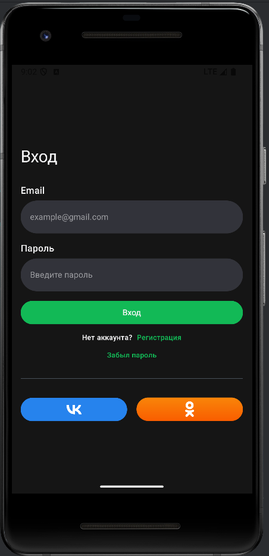
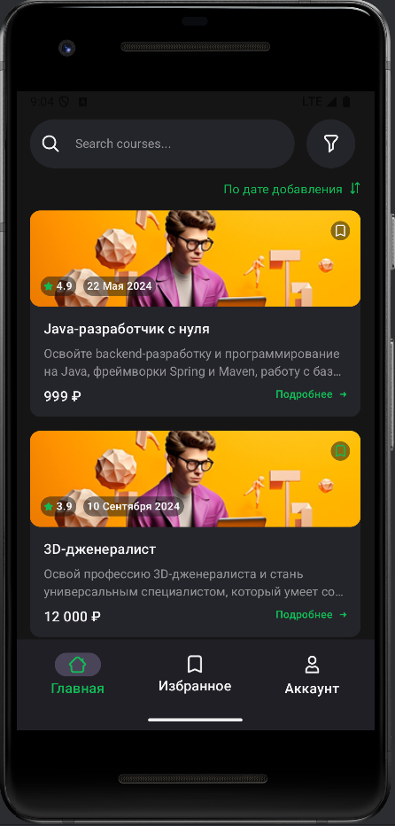

# 1000 Courses
Тестовое задание на позицию Junior Android Developer: мобильное приложение для просмотра и выбора онлайн курсов.

Решение: MVVM + Compose UI + Retrofit/Room.
Демонстрирует навыки работы с сетью, архитектурой и UI.

## ✨ UI Overview

  
  
  

## 🚀 Установка
1. Клонируйте: `git clone https://github.com/Horsen121/EffectiveMobileTest`
2. Откройте в Android Studio
3. Синхронизируйте Gradle: `./gradlew build`
4. Запустите: `Run > Run 'app'`

## 🛠 Стек

- **UI**: Jetpack Compose, Navigation
- **Архитектура**: MVVM + Coroutines/Flow
- **Данные**: Room, Retrofit 2 + Gson
- **DI**: Dagger Hilt
